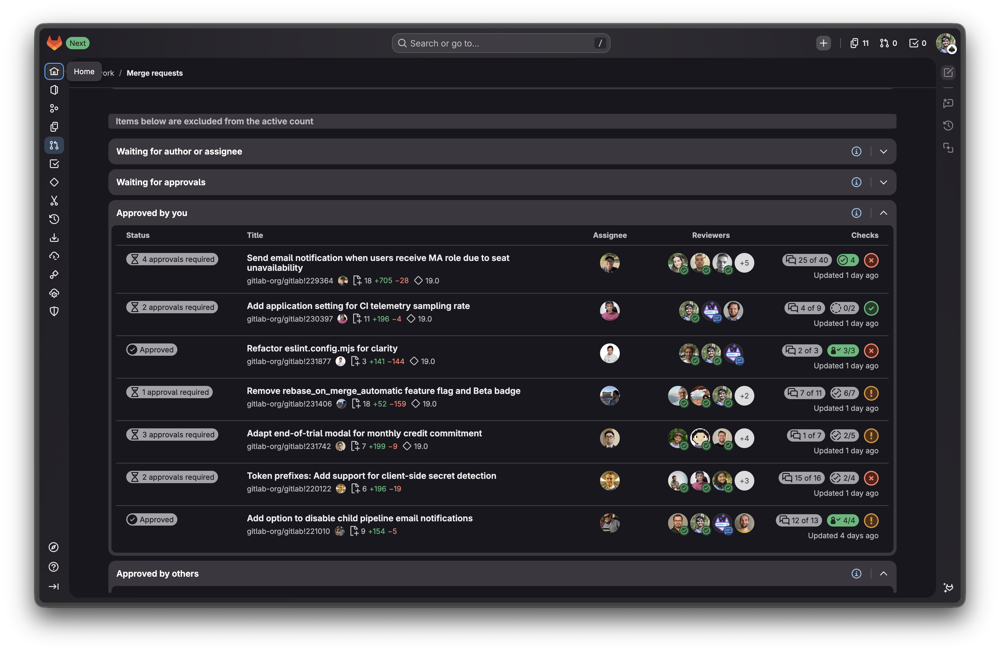

# GitLab Notification Button

Adds a notification toggle button to every merge request on the GitLab dashboard (`/dashboard/merge_requests`), allowing you to quickly subscribe or unsubscribe from MR notifications without opening each one.

| Before | After |
| ------------------------------------------ | ---------------------------------------- |
|  |  |

## Installation

### Firefox

Install the add-on from [Mozilla Add-ons](https://addons.mozilla.org/addon/gitlab-notification-button/).

### Chrome

Since this is a simple extension with no build process, you can load it directly.

1.  Clone the repository:
    ```sh
    git clone https://gitlab.com/abhayvashokan/gitlab-notifications-button.git
    ```
2.  Open Chrome and navigate to `chrome://extensions`.
3.  Enable **Developer mode** using the toggle in the top right corner.
4.  Click the **Load unpacked** button.
5.  Select the directory where you cloned the repository (the folder that contains the `manifest.json` file).
